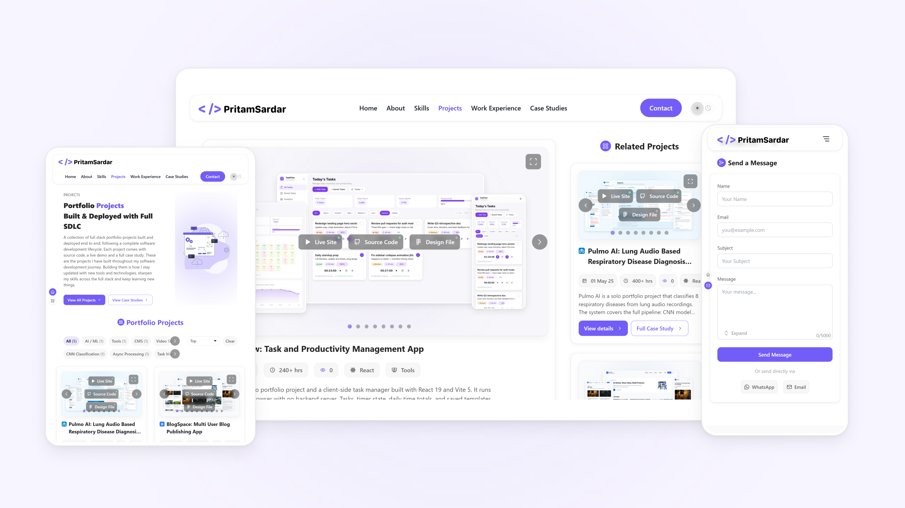

# Personal Portfolio

A full stack developer portfolio with its own content management system built in. Pages, projects, and work history live in MongoDB and can be edited directly from a floating admin panel, with no code changes or redeploys needed.

Live: https://pritamsardar.dev  |  Case Study: https://www.pritamsardar.dev/full-case-study/project-row-personal-portfolio-site?source=case-studies

<picture>
  <source media="(prefers-color-scheme: dark)" srcset=".github/images/personal-portfolio-hero-dark.png">
  
</picture>

## Features

* Edit any page text, image, or work history entry from a floating admin panel, with a live preview before saving
* Browse projects and case studies with category filters, sorting, and pagination synced to the URL
* Get related project suggestions based on matching category and tags when viewing a single project or case study
* Count each project view once per visitor using a hashed IP address, with no cookies or local storage involved
* Send a message through the contact form with validation, a saved draft while typing, and a limit of three submissions per IP per day
* Receive an automatic confirmation email through Resend after every contact form submission
* Stage admin image uploads in the browser before committing them to Cloudinary, so a cancelled edit never uses storage
* Switch between light and dark mode with the theme applied before the page paints, so there is no flash on load
* Watch project carousels take turns animating within a section instead of all running at once
* Jump to any page section through a floating navigation panel that highlights the section currently in view
* Reset any page, section, or row back to its default content directly from the admin panel

## Tech Stack

**Frontend:** React 19, Vite 7, Tailwind CSS v4, React Router 7

**Forms:** React Hook Form, Zod

**State:** React Context API

**Backend:** Node.js, Express 5

**Database:** MongoDB, Mongoose

**Auth:** JWT, bcrypt

**File Uploads:** Multer, Cloudinary

**Email:** Resend

## Getting Started

### Prerequisites

* Node.js 18 or higher
* MongoDB local instance or Atlas account

### Clone and install

```bash
git clone https://github.com/pritamsardar-dev/personal-portfolio-pritam-sardar-v1.git
cd personal-portfolio-pritam-sardar-v1

# Install server dependencies
cd server && npm install

# Install client dependencies
cd ../client && npm install
```

### Environment variables

Create a `.env` file inside the `server` directory:

```env
PORT=5000
MONGODB_URI=your_mongodb_connection_string
CORS_ORIGIN=http://localhost:5173

JWT_SECRET=your_jwt_secret_key
JWT_SECRET_EXPIRY=1d

CLOUDINARY_CLOUD_NAME=your_cloud_name
CLOUDINARY_API_KEY=your_api_key
CLOUDINARY_API_SECRET=your_api_secret

RESEND_API_KEY=your_resend_api_key

IP_HASH_SALT=your_random_salt_string
RATE_LIMIT_MAX=3
RATE_LIMIT_WINDOW_MS=86400000
```

Create a `.env` file inside the `client` directory:

```env
VITE_API_BASE_URL=http://localhost:5000/api/v1
```

Update `CORS_ORIGIN` and `VITE_API_BASE_URL` to your deployed URLs before building for production.

### Seed an admin account

The admin panel needs at least one admin user in the database before you can log in.

```bash
cd server
npm run seed:admin
```

### Run locally

```bash
# Start the backend, run from /server
npm run dev

# Start the frontend, run from /client
npm run dev
```

App runs at `http://localhost:5173` and the API at `http://localhost:5000`.

## Project Structure

```
client/
├── public/
│   └── theme-init.js              # Applies the saved theme before React mounts, prevents a flash
├── scripts/                       # SVG to JSX and SVG to markup codegen for the icon set
├── src/
│   ├── api/                       # Axios calls grouped by resource
│   │   └── admin/                 # Admin only endpoints: auth, pages, sections, rows, messages
│   ├── assets/
│   │   ├── icons-raw/             # Source SVGs before code generation
│   │   └── icons/                 # Generated icon components, indexed automatically by script
│   ├── components/
│   │   ├── atoms/                 # Button, text, tag, form field, avatar, tooltip, theme toggle
│   │   ├── molecules/             # Navigation list, pagination, popup message, work experience rows
│   │   ├── organisms/             # Header, footer, hero, contact, filter bar, work items, carousel
│   │   ├── sections/              # Page specific sections (about, home, skills, admin login)
│   │   ├── admin/                 # AutoFormEditor and the contact inbox
│   │   ├── overlays/              # Modal used for dialogs and the fullscreen carousel view
│   │   ├── system/                # Section navigation panel, scroll restoration
│   │   └── wrappers/              # Horizontal wheel scroll wrapper for tag rows
│   ├── context/                   # Context definitions for auth, admin editor, modal, refs, nav
│   ├── providers/                 # Context providers, composed together in AppProviders
│   ├── hooks/                     # useAuth, useCTA, useFiltersPagination, carousel coordination
│   ├── layout/                    # Root layout: header, page outlet, footer, nav panel
│   ├── loading/
│   │   └── pageLoadingStructures/ # Skeleton page shapes shown while CMS data is still loading
│   ├── modules/                   # Page containers that fetch data and hand it to the renderers
│   ├── renderers/
│   │   ├── pages/                 # Walks page.sections from the CMS and renders each one
│   │   ├── sections/              # Maps a section key to its component
│   │   └── blocks/                # Maps a block type to its component
│   ├── routes/                    # AppRoutes, ProtectedRoute
│   ├── styles/
│   │   ├── tokens/                # Core, semantic, and theme level CSS variables
│   │   └── utilities/             # Scrollbar, focus ring, modal backdrop, feedback animation
│   ├── utils/                     # resolveProps, theme helpers, IndexedDB and storage keys
│   └── validation/                # Zod schemas for the contact form and admin login

server/
├── seeder/
│   └── admin.seed.js              # Creates the first admin account
├── src/
│   ├── config/                    # MongoDB connection, Cloudinary setup, env loading
│   ├── controllers/                # Route handler logic
│   │   └── admin/                  # Admin auth, page, section, row, and message handlers
│   ├── middlewares/                 # JWT auth guard, multer upload
│   ├── models/                      # Page, Section, Header, Footer, SiteConfig, Message, RowView, Admin
│   ├── routes/                      # Express routers
│   │   └── admin/                   # Admin only routes, protected by the auth middleware
│   ├── services/
│   │   └── email.services.js        # Sends the contact form auto reply through Resend
│   ├── templates/                    # Default content restored when an admin resets a page or section
│   └── utils/                        # IP hashing, public id extraction, Cloudinary cleanup, tokens
├── app.js                             # Express app, CORS, cookie parsing, route mounting
└── server.js                          # Entry point, connects to MongoDB and starts the server
```

## Technical Notes

### Context based content resolution

CMS documents for shared blocks, like the skills section, often need to render differently depending on where they appear. A heading might need to say one thing on the home page and something else on the dedicated skills page. Instead of duplicating the block for every page, the schema stores every variant inside the same object under a context key, for example `{ home: {...}, skills: {...} }`. A small recursive function called resolveProps walks the object and, given a context string, replaces any node that has a matching key with just that node's value. The result is one document in MongoDB that can serve more than one page, and a renderer that always receives a flat, page ready shape no matter which page asked for it.

### Drafts staged in IndexedDB before upload

The admin editor lets you swap out an image, drag the window around, and decide later whether to save the change or cancel it. Uploading every selected file straight to Cloudinary the moment it gets picked would waste storage on edits nobody ends up keeping. Instead, the picked file is written to IndexedDB inside the browser, and a reference like indexeddb://draftKey__fieldKey is stored in the form state. The image renders from a generated blob URL while editing continues. Only when Save is pressed does the editor read the actual file back out of IndexedDB and attach it to the request that uploads it to Cloudinary. Cancelling a draft just clears the IndexedDB entry, so no upload ever happens.

### View counts without cookies or local storage

Each project and case study tracks how many people have viewed it, and the page also needs to know whether the current visitor has already seen a given row, so the eye icon can be highlighted for it. Both come from the same source, a RowView collection that stores a hash of the visitor's IP address against a row id, with a unique index on that pair so the same visitor can never be counted twice for the same row. The raw IP is hashed with HMAC before it gets stored, so the actual address is never written to the database. A single batched query checks which rows on a page already have a matching RowView for the current visitor, so the viewed state for an entire list comes back in one round trip instead of one query per row.

### One carousel animates at a time

The home page and the work items pages place several auto playing carousels next to each other. If each carousel ran its own timer on its own, several of them would animate at the same time and the page would feel busy. A small coordinator module, scoped to a section rather than to a single component, keeps track of which carousels are currently in the viewport and hands an active signal to one of them at a time. Once a carousel finishes a full cycle, it tells the coordinator to pass the signal on to the next one in view. Scrolling, resizing, or interacting with a carousel directly all update what the coordinator knows, so the handoff always matches what the visitor can actually see and what they just touched.

## Future Ideas

* Migrate to TypeScript starting at the renderer layer and resolveProps utility so variant mismatches are caught at compile time
* Extend the admin editor to support creating, reordering, and deleting work item rows without a seed script or direct database edit
* Add an analytics dashboard in the admin panel showing view counts, contact form submission rates, and most visited pages
* Real-time preview sync using server-sent events so saved changes reflect in a separate tab without a manual refresh
* Optimize images at upload time using Cloudinary transformation parameters to reduce carousel transfer size

## License

Licensed under the MIT License. See [LICENSE](./LICENSE) for details.

## Author

**Pritam Sardar**

GitHub: [github.com/pritamsardar-dev](https://github.com/pritamsardar-dev)

LinkedIn: [linkedin.com/in/pritam-sardar-dev](https://www.linkedin.com/in/pritam-sardar-dev/)

Portfolio: [pritamsardar.dev](https://pritamsardar.dev)

Email: [pritamsardar.dev@gmail.com](mailto:pritamsardar.dev@gmail.com)